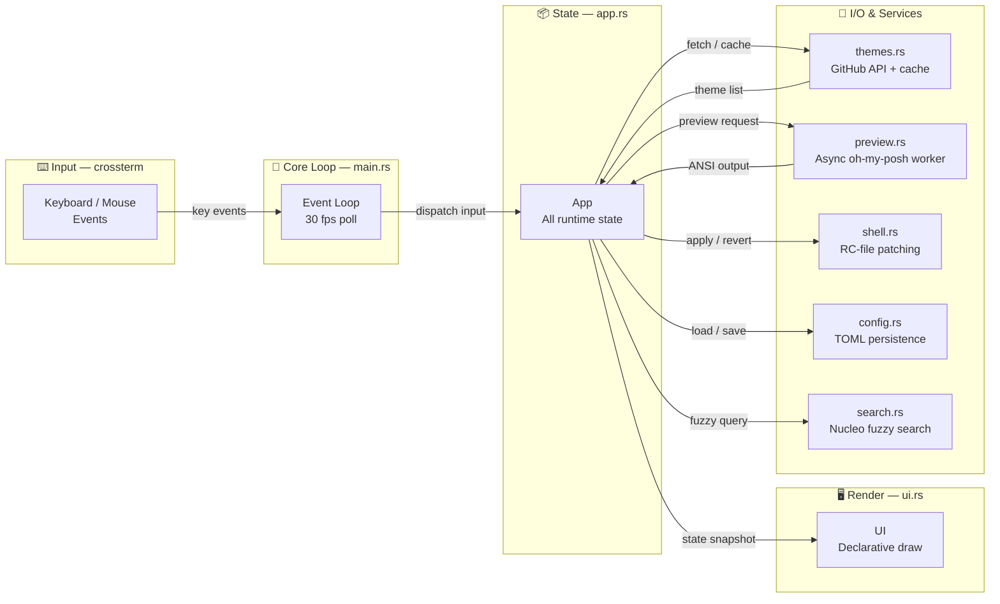

# posh-tui — Project Documentation

> A terminal UI for browsing, previewing, and applying Oh My Posh themes — built in Rust.

---

## Table of Contents

1. [Project Overview](#1-project-overview)
2. [Features](#2-features)
3. [Architecture](#3-architecture)
4. [Module Reference](#4-module-reference)
5. [Keybindings](#5-keybindings)
6. [Configuration & Cache](#6-configuration--cache)
7. [Installation](#7-installation)
8. [Development](#8-development)
9. [CI/CD](#9-cicd)
10. [Dependencies](#10-dependencies)
11. [Testing](#11-testing)

---

## 1. Project Overview

**posh-tui** is a Rust-based terminal user interface that lets users browse, preview, and apply [Oh My Posh](https://ohmyposh.dev) themes directly from the terminal. It fetches the full theme catalog from GitHub, renders live previews by invoking the real `oh-my-posh` binary, and manages shell configuration files with safe, idempotent patching.

### Why it exists

Oh My Posh ships with 120+ themes but provides no interactive browser. Users must manually edit shell configs and restart terminals to try themes. posh-tui solves this by providing:

- A scrollable, searchable list of all themes
- Live ANSI previews rendered by the actual oh-my-posh binary
- One-key apply with automatic backup and undo
- An immersive full-screen preview mode with simulated shell commands

### Key facts

| Metric | Value |
|--------|-------|
| Language | Rust (edition 2021) |
| Version | 0.2.0 |
| Lines of code | ~2,400 (9 source files) |
| Binary size | 4.2 MB (release, stripped) |
| Dependencies | 11 crates |
| Test count | 28 unit tests |
| Platforms | Linux (x64 + ARM64), macOS (x64 + ARM), WSL, Windows |

---

## 2. Features

### Core features (fully implemented)

| Feature | Description |
|---------|-------------|
| **Theme browsing** | Scrollable list of all 120+ Oh My Posh themes fetched from GitHub |
| **Live ANSI preview** | Calls `oh-my-posh print primary` to render the actual prompt with full colors |
| **Auto-preview on navigation** | Preview updates automatically when scrolling (165ms debounce) |
| **Immersive mode** | Full-screen preview at true terminal width with a fake interactive shell |
| **Theme application** | Writes managed block to shell rc file (bash/zsh/fish) with backup |
| **Undo / revert** | Three tiers: undo (restore backup), soft revert (remove block), hard revert (remove all omp lines) |
| **Fuzzy search** | Powered by nucleo — case-insensitive with smart normalization |
| **Favourites** | Toggle favourites per theme, filter to show only favourites |
| **Recently viewed** | Tracks last 10 previewed themes, accessible via `R` key |
| **Random theme** | Press `x` to jump to a random theme |
| **Horizontal scroll + zoom** | Scroll preview left/right, zoom in/out to adjust column width |
| **Config persistence** | Favourites, last applied, zoom factor, and recent themes persisted to TOML |
| **Offline fallback** | Caches theme list JSON; loads from cache when GitHub API is unavailable. Retries up to 3× with backoff before falling back |
| **Cross-platform CI** | GitHub Actions builds for Linux (x64 + ARM64), macOS (x64 + ARM), and Windows |

### Immersive mode commands

The immersive mode simulates a shell environment. Available fake commands:

| Command | Output |
|---------|--------|
| `ls`, `ls -la` | Colored directory listing |
| `pwd` | Current path |
| `whoami` | Current user |
| `git status` | Branch status with colored diffs |
| `git log` | Colored commit history |
| `git branch` | Branch list with current branch highlighted |
| `echo` | Echoes input |
| `uname -a` | System information |
| `cargo build` / `cargo run` | Build output simulation |
| `neofetch` / `fastfetch` | System info display with ASCII art |
| `cat Cargo.toml` | File contents |
| `clear` | Clears screen |
| `help` | Lists available commands |

---

## 3. Architecture

### Design pattern

The project follows an **Elm-like architecture** (Model-Update-View):



### Data flow

```mermaid
sequenceDiagram
    autonumber
    participant M  as main.rs
    participant A  as app.rs
    participant T  as themes.rs
    participant PW as preview.rs
    participant SH as shell.rs
    participant UI as ui.rs
    participant GH as GitHub API
    participant OMP as oh-my-posh CLI

    rect rgb(30, 40, 60)
        note over M,GH: 🚀 Startup
        M->>T: fetch_theme_list() [background task, 3× retry + backoff]
        T->>GH: GET /repos/JanDeDobbeleer/oh-my-posh/contents/themes
        GH-->>T: JSON theme list
        T-->>M: AppEvent::ThemesLoaded
        M->>A: init_themes(list)
        M->>A: load_shell_info()
    end

    rect rgb(30, 50, 40)
        note over M,UI: 🎨 Navigation & Preview (165 ms debounce)
        M->>A: handle_normal() → move_up / move_down
        A->>A: set preview_timer (5 ticks)
        A->>A: step_preview_timer() fires → trigger_preview()
        A->>T: download_theme() if not in local cache
        A->>PW: request(theme_path, columns)
        PW->>OMP: oh-my-posh print primary --config <theme>
        OMP-->>PW: ANSI-escaped stdout
        PW-->>A: poll_preview() → preview_output string
        A->>A: ansi_to_text() → cached_preview [parsed ONCE]
        A-->>UI: draw() reads cached_preview [every frame, no re-parse]
    end

    rect rgb(60, 30, 30)
        note over M,SH: ✅ Apply Theme  (Enter → Confirm → Enter)
        M->>A: handle_confirm() → do_apply()
        A->>SH: apply_theme(omp_path, theme_path, shell)
        SH->>SH: backup rc file → .posh-tui.bak
        SH->>SH: write managed block (# posh-tui:start … end)
        A->>A: save config (last_applied, favourites, zoom, recent)
    end

    rect rgb(50, 40, 20)
        note over M,SH: ↩️ Revert Options
        M->>A: u → do_undo()
        A->>SH: undo() → restore from .posh-tui.bak
        M->>A: U → do_soft_revert()
        A->>SH: soft_revert() → remove managed block only
        M->>A: Ctrl+U → do_hard_revert()
        A->>SH: hard_revert() → remove ALL oh-my-posh lines
    end
```



### Module responsibilities

| Module | Lines | Role |
|--------|------:|------|
| `ui.rs` | 702 | Rendering: layout, list, preview, immersive, ANSI parsing, modal overlays |
| `app.rs` | 622 | Central state model, navigation, search, preview, shell operations, immersive |
| `shell.rs` | 418 | Shell detection, rc-file patching (apply/undo/soft-revert/hard-revert), backup management |
| `main.rs` | 246 | Entry point, terminal setup/teardown, event loop, input dispatch |
| `themes.rs` | 97 | GitHub API theme list fetch, theme download, offline cache |
| `config.rs` | 82 | TOML-based config persistence (favourites, zoom, last_applied, recent) |
| `preview.rs` | 78 | Async worker that spawns `oh-my-posh` CLI and returns stdout |
| `search.rs` | 57 | Fuzzy search wrapper around nucleo matcher |
| `error.rs` | 36 | `PoshError` enum with `From` conversions |

---

## 4. Module Reference

### 4.1 `main.rs` — Entry point & event loop

**Responsibilities:**
- Terminal initialization (raw mode, alternate screen, mouse capture)
- Background theme fetching with network/cached fallback
- Event loop running at ~30fps (33ms poll interval)
- Input dispatch per mode (Normal, Search, Confirm, Immersive, Help, SoftRevert, HardRevert, Message)

**Key functions:**
- `main()` — Bootstraps cache directory, terminal, and background fetch task
- `run_app()` — Core loop: poll events → tick → draw → handle input
- `handle_normal()` — 20+ keybindings for navigation, preview, search, favourites, etc.
- `handle_search()` — Character input, backspace, cancel
- `handle_confirm()` — Enter to apply, Esc to cancel
- `handle_immersive()` — Typing, Enter for command, Ctrl+A for apply, Esc to exit

### 4.2 `app.rs` — State model & behavior

**Responsibilities:**
- Holds all runtime state (~25 public fields)
- Navigation (up/down/top/bottom/page), search, preview orchestration
- Shell operations (apply, undo, soft revert, hard revert)
- Immersive mode command simulation
- Config persistence
- ANSI preview caching (parsed once per update, not per frame)

**Key types:**
- `Mode` — Enum: Normal, Search, Confirm, Help, Immersive, SoftRevert, HardRevert, Message
- `App` — Central state struct with all runtime fields
- `ImmLine` / `ImmKind` — Immersive history line representation (`Prompt`, `Input`, `Output`)

**Notable fields:**
- `cached_preview: Option<Text<'static>>` — Parsed ANSI preview text, populated once in `poll_preview()` and read by `ui.rs` each frame instead of re-parsing

**Key methods:**
- `new()` — Initializes state, restores config, spawns preview worker
- `selected_theme()` — Maps selection to Theme via visible list (favourites-aware)
- `visible_themes()` — Filters by favourites or recent view
- `trigger_preview()` — Downloads theme if needed, sends to preview worker, tracks recent
- `poll_preview()` — Collects worker output, parses ANSI once into `cached_preview`
- `step_preview_timer()` — Decrements debounce timer, returns true when ready to trigger
- `random_theme()` — Picks random index from visible themes
- `do_apply()` / `do_undo()` / `do_soft_revert()` / `do_hard_revert()` — Shell operations

### 4.3 `ui.rs` — Rendering

**Responsibilities:**
- Declarative rendering of all UI elements
- ANSI escape sequence parsing via `ansi-to-tui` crate (parsing done in `app.rs`; `ui.rs` reads cached `Text<'static>`)
- Horizontal scroll with span-aware slicing (preserves styling)
- Modal overlays (help, confirm, soft revert, hard revert, message)

**Key functions:**
- `draw()` — Top-level dispatcher; switches to immersive if active
- `draw_search()` — Search bar with mode-driven styling and title
- `draw_main()` — List + preview split layout
- `draw_list()` — Theme list with star/applied indicators
- `draw_preview()` — Preview pane; reads `app.cached_preview` (no re-parse per frame)
- `draw_immersive()` — Full-screen pseudo-shell with history + input line
- `ansi_to_text()` — `pub(crate)` wrapper around `ansi-to-tui::IntoText`; called from `app.rs`
- `draw_help()` / `draw_confirm()` / `draw_soft_revert()` / `draw_hard_revert()` / `draw_message()` — Modal dialogs
- `centered_rect()` — Helper for centered popup positioning

### 4.4 `shell.rs` — Shell integration

**Responsibilities:**
- Shell detection via `$SHELL` environment variable
- Rc file path resolution for bash, zsh, and fish
- Managed block patching (apply, replace, remove)
- Backup management and restoration

**Key types:**
- `Shell` — Enum: Bash, Zsh, Fish, Unknown
- `ShellInfo` — Current shell state: path, has_managed_block, has_any_omp, backup_path

**Key functions:**
- `apply_theme(&Path, ...)` — Creates backup, writes managed block (appends or replaces)
- `soft_revert()` — Removes only the posh-tui managed block
- `hard_revert()` — Removes all lines containing "oh-my-posh"
- `undo()` — Restores from backup file
- `replace_managed_block()` — Idempotent replacement of managed block
- `remove_managed_block()` — Extracts managed block from rc file
- `remove_all_omp_lines()` — Removes all oh-my-posh lines
- `which_omp()` — Resolves oh-my-posh binary path
- `backup_path_for(&Path)` — Generates `.posh-tui.bak` path for a given rc file

> **Note:** All file-path parameters use `&Path` (not `&PathBuf`) for idiomatic Rust API design.

### 4.5 `themes.rs` — Theme sourcing

**Responsibilities:**
- Fetch theme list from GitHub Contents API with automatic retry
- Download theme files to local cache
- Save/load theme list cache for offline use

**Key functions:**
- `fetch_theme_list()` — Retries up to 3× (1 s / 2 s / 4 s backoff), then returns last error. Inner work delegated to `try_fetch_theme_list()`
- `try_fetch_theme_list()` — Single GET to GitHub API, filters `.omp.json` files, returns `Vec<Theme>`
- `download_theme(&Path, ...)` — Fetch raw theme file, cache to disk
- `save_theme_list_cache(&Path, ...)` — Serialize theme list to `themes_cache.json`
- `load_cached_theme_list(&Path)` — Load cached theme list from disk

> **Note:** All cache-directory parameters use `&Path` (not `&PathBuf`).

### 4.6 `preview.rs` — Preview pipeline

**Responsibilities:**
- Run `oh-my-posh print primary` asynchronously
- Return stdout as styled preview output

**Key types:**
- `PreviewWorker` — Tokio task + mpsc channel + shared Mutex for output
- `PreviewMsg` — Load(path, width) or Quit

**Key functions:**
- `spawn()` — Creates background worker task
- `request()` — Sends preview request to worker
- `take_output()` — Polls for completed preview output
- `render_preview()` — Spawns oh-my-posh process with COLUMNS/LINES env vars

### 4.7 `config.rs` — Configuration

**Responsibilities:**
- Persist user preferences to TOML
- Load/save with fault-tolerant defaults

**Key fields:**
- `last_applied: Option<String>` — Last applied theme name
- `favourites: HashSet<String>` — Favourited theme names
- `zoom_factor: f32` — Preview zoom level (0.5–3.0)
- `recent: Vec<String>` — Last 10 previewed theme names

**Key functions:**
- `load()` — Load from disk or fall back to defaults
- `save()` — Write TOML to `~/.config/posh-tui/config.toml`
- `push_recent()` — Add theme to front of recent list, deduplicate, truncate to 10

### 4.8 `search.rs` — Fuzzy search

**Responsibilities:**
- Wrap nucleo matcher for fuzzy search
- Case-insensitive with smart normalization

**Key functions:**
- `new()` — Initialize nucleo with theme names
- `query()` — Reparse pattern, tick matcher, return sorted results

### 4.9 `error.rs` — Error types

**Responsibilities:**
- Unified error type with Display and From conversions

**Variants:**
- `Io` — std::io::Error
- `Http` — reqwest::Error
- `Json` — serde_json::Error
- `Toml` — toml::de::Error
- `TomlSer` — toml::ser::Error
- `Preview(String)` — Preview-specific errors
- `Shell(String)` — Shell operation errors
- `Config(String)` — Configuration errors

---

## 5. Keybindings

### Navigation

| Key | Action |
|-----|--------|
| `↑` / `k` | Move up |
| `↓` / `j` | Move down |
| `g` | Jump to top |
| `G` | Jump to bottom |
| `PgUp` | Page up (10 items) |
| `PgDn` | Page down (10 items) |

### Preview

| Key | Action |
|-----|--------|
| `Space` | Preview selected theme in side pane |
| `p` | Immersive full-screen preview |
| `<` / `>` | Scroll preview left / right |
| `-` / `=` | Zoom out / in |
| `0` | Reset zoom |

### Immersive mode

| Key | Action |
|-----|--------|
| `Enter` | Run fake command |
| `Ctrl+A` | Apply theme from immersive mode |
| `Esc` | Return to browser |

### Actions

| Key | Action |
|-----|--------|
| `Enter` | Apply selected theme to shell config |
| `u` | Undo last apply (restores backup) |
| `U` | Soft revert — remove posh-tui block only |
| `Ctrl+U` | Hard revert — remove all oh-my-posh lines |
| `f` | Toggle favourite |
| `F` | Toggle favourites-only view |
| `R` | Toggle recently viewed view |
| `x` | Jump to random theme |
| `r` | Refresh theme list from GitHub |
| `/` | Fuzzy search |
| `?` | Help overlay |
| `q` / `Ctrl+C` | Quit |

---

## 6. Configuration & Cache

### Config file

Location: `~/.config/posh-tui/config.toml`

```toml
last_applied = "catppuccin"

favourites = [
  "catppuccin",
  "tokyo-night",
  "agnoster",
]

zoom_factor = 1.0

recent = [
  "catppuccin",
  "tokyo-night",
  "powerlevel10k",
]
```

### Cache locations

```
~/.cache/posh-tui/
├── themes/                    # Downloaded .omp.json files
│   ├── catppuccin.omp.json
│   ├── tokyo-night.omp.json
│   └── ...
└── themes_cache.json          # Cached theme list for offline use
```

### Shell rc file patching

When you apply a theme, posh-tui writes a managed block to your shell config:

```bash
# posh-tui:start
eval "$(/home/user/.local/bin/oh-my-posh init bash --config /home/user/.cache/posh-tui/themes/catppuccin.omp.json)"
# posh-tui:end
```

**Backup locations:**
- `~/.bashrc.posh-tui.bak`
- `~/.zshrc.posh-tui.bak`
- `~/.config/fish/config.fish.posh-tui.bak`

---

## 7. Installation

### Prerequisites

- [Oh My Posh](https://ohmyposh.dev/docs/installation/linux) installed and in `$PATH`
- A [Nerd Font](https://www.nerdfonts.com) installed and set in your terminal
- Rust 1.70+ (for building from source)

### Curl install (recommended)

```bash
curl -sSf https://raw.githubusercontent.com/RayenBHK/posh-tui/main/install.sh | bash
```

The installer:
1. Detects your OS and architecture
2. Fetches the latest release from GitHub
3. Installs to `~/.local/bin/posh-tui`

### Cargo install

```bash
cargo install --git https://github.com/RayenBHK/posh-tui
```

### Manual build

```bash
git clone https://github.com/RayenBHK/posh-tui
cd posh-tui
cargo build --release
./target/release/posh-tui
```

### Usage

```bash
posh-tui
```

The app opens instantly. Themes load from GitHub in the background with a spinner.

---

## 8. Development

### Project structure

```
posh-tui/
├── src/
│   ├── main.rs          # Entry point, event loop, input dispatch
│   ├── app.rs           # State model, navigation, search, preview, shell ops
│   ├── ui.rs            # Rendering, ANSI parsing, layouts, modals
│   ├── shell.rs         # Shell detection, rc-file patching, backup management
│   ├── themes.rs        # GitHub API fetch, download, offline cache
│   ├── config.rs        # TOML config persistence
│   ├── preview.rs       # Async oh-my-posh worker
│   ├── search.rs        # Nucleo fuzzy search
│   └── error.rs         # Error types
├── .github/workflows/
│   └── release.yml      # CI/CD for cross-platform releases
├── Cargo.toml           # Dependencies and build config
├── install.sh           # Curl installer script
├── analysis.md          # Initial project analysis
└── DOCUMENTATION.md     # This file
```

### Building

```bash
# Debug build
cargo build

# Release build (optimized + stripped)
cargo build --release
```

### Running

```bash
cargo run
cargo run --release
```

### Binary size

The release binary is ~4.2 MB after stripping. Breakdown:
- Rust standard library + tokio runtime: ~2 MB
- ratatui + crossterm: ~500 KB
- reqwest + TLS: ~800 KB
- nucleo: ~200 KB
- ansi-to-tui + rand: ~200 KB
- Application code: ~100 KB

---

## 9. CI/CD

### GitHub Actions workflow

File: `.github/workflows/release.yml`

**Trigger:** Push a tag matching `v*` (e.g., `git tag v0.2.0 && git push --tags`)

**Build matrix:**

| Target | OS | Artifact | Toolchain |
|--------|-----|----------|-----------|
| `x86_64-unknown-linux-gnu` | ubuntu-latest | `posh-tui-x86_64-linux` | cargo |
| `aarch64-unknown-linux-gnu` | ubuntu-latest | `posh-tui-aarch64-linux` | cross |
| `x86_64-apple-darwin` | macos-latest | `posh-tui-x86_64-macos` | cargo |
| `aarch64-apple-darwin` | macos-latest | `posh-tui-aarch64-macos` | cargo |
| `x86_64-pc-windows-msvc` | windows-latest | `posh-tui-x86_64-windows.exe` | cargo |

> The `aarch64-unknown-linux-gnu` target uses [`cross`](https://github.com/cross-rs/cross) for Docker-based cross-compilation. The `cross: true` matrix flag triggers its installation and use automatically.

**Pipeline:**
1. Checkout → Rust toolchain → Cache dependencies
2. Build release binary for each target
3. Upload artifacts
4. Create GitHub release with auto-generated notes
5. Attach all platform binaries

### Releasing

```bash
git tag v0.2.0
git push --tags
```

The CI will automatically build and attach binaries to a new GitHub release.

---

## 10. Dependencies

| Crate | Version | Purpose |
|-------|---------|---------|
| `ratatui` | 0.29 | TUI framework — layout, widgets, rendering |
| `crossterm` | 0.28 | Terminal raw mode, alternate screen, keyboard events |
| `tokio` | 1 (full) | Async runtime, process spawning, channels |
| `reqwest` | 0.12 (json) | HTTP client for GitHub API |
| `serde` | 1 (derive) | Serialization/deserialization |
| `serde_json` | 1 | JSON parsing for GitHub API and theme cache |
| `toml` | 0.8 | TOML config file parsing |
| `dirs-next` | 2 | Cross-platform config/cache/home directory resolution |
| `nucleo` | 0.5 | Fuzzy matcher for theme search |
| `ansi-to-tui` | 7 | ANSI escape sequence parsing to ratatui Text |
| `rand` | 0.9 | Random theme selection |

---

## 11. Testing

### Running tests

```bash
cargo test
```

### Test coverage — 28 tests total

#### `shell.rs` — 14 tests (rc-file patching logic)

**`replace_managed_block` (3 tests):**
- Replaces existing managed block with new content
- Preserves surrounding config when no block exists
- Handles complex multi-line rc files

**`remove_managed_block` (4 tests):**
- Removes managed block while preserving other content
- Handles files with no managed block
- Handles empty files
- Handles files containing only the managed block

**`remove_all_omp_lines` (4 tests):**
- Removes all lines containing "oh-my-posh"
- Removes manual oh-my-posh lines
- Handles files with no oh-my-posh lines
- Handles empty files

**`backup_path_for` (3 tests):**
- Generates correct backup path for `.bashrc`
- Generates correct backup path for `.zshrc`
- Generates correct backup path for fish config

#### `config.rs` — 4 tests

- `test_defaults_on_missing_file` — `Config::load()` returns sensible defaults without panicking
- `test_push_recent_dedup` — pushing the same theme name twice results in one entry
- `test_push_recent_truncate` — pushing 12 names keeps the list at ≤ 10 entries
- `test_push_recent_order` — most recently pushed name appears first

#### `search.rs` — 4 tests

- `test_exact_match_included` — querying "catppuccin" includes "catppuccin" in results
- `test_no_match_returns_empty` — nonsense query returns empty results
- `test_case_insensitive` — "CATPPUCCIN" matches "catppuccin"
- `test_empty_query_returns_all` — empty query returns all theme names

#### `app.rs` — 6 tests (async, `#[tokio::test]`)

- `test_zoom_in_bounded` — `zoom_in()` never exceeds maximum zoom factor
- `test_zoom_out_bounded` — `zoom_out()` never goes below minimum zoom factor
- `test_zoom_reset` — `zoom_reset()` restores `zoom_factor` to `1.0`
- `test_toggle_favourite_adds_and_removes` — double-toggle leaves favourites empty
- `test_move_up_at_top_clamps` — `move_up()` at index 0 stays at 0
- `test_visible_themes_favs_filter` — `show_favs=true` returns only favourited themes

### What's still not tested (future additions)

- Integration tests for `apply_theme()` end-to-end (requires `tempdir`)
- `themes.rs` fetch/download with mocked HTTP (`wiremock` or `httpmock`)
- Snapshot tests for ANSI rendering output
- `main.rs` event loop (requires terminal mock)
